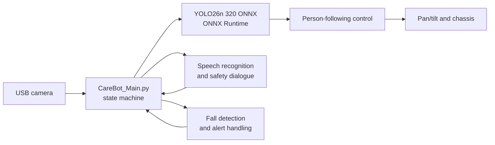

# CareBot V3

CareBot V3 is a Raspberry Pi-based companion and person-following robot. It
combines a camera, YOLO26 person detection, chassis control, voice interaction,
and fall-response handling into one runtime application.

## System architecture



## Features

- Real-time COCO `person` detection with YOLO26 Nano ONNX.
- Person-following state machine with search, follow, and safety states.
- Pan/tilt and chassis motor control for the Raspberry Pi robot platform.
- Voice interaction and safety-response recognition.
- Fall-event detection, image capture, sound alert, and optional line alert.
- TensorFlow SSD detector retained as a fallback for comparison.

## Requirements

- Raspberry Pi 5 with a supported camera and CareBot chassis/I2C hardware.
- Python 3.11 (the project was tested with it).
- `opencv-python`, `numpy`, and `onnxruntime`.
- Optional: `mediapipe` enables pose-based near-distance protection. The robot
  remains operational without it and uses bounding-box safety checks instead.
- Robot hardware libraries used by `Track_SSD_Person_Follow.py`.
- A display session, or use `--no-window` for SSH operation.

## Installation

Clone or copy this directory to the Raspberry Pi, then install the required
Python runtime packages:

```bash
python3 -m pip install opencv-python numpy onnxruntime
```

For the optional pose-based near-distance check, install MediaPipe as well:

```bash
python3 -m pip install mediapipe
```

The repository contains the supported model files in `models/`; no PyTorch or
Ultralytics runtime is required on the robot.

## Run

Run with motors enabled only in a clear, safe test area:

```bash
cd CareBot_V3
python3 CareBot_Main.py
```

Useful diagnostic options:

```bash
# Test camera and detection without moving the chassis
python3 CareBot_Main.py --no-motor

# Run over SSH without an OpenCV window
python3 CareBot_Main.py --no-window

# Use the retained TensorFlow SSD detector
python3 CareBot_Main.py --detector ssd --no-motor
```

## Project layout

```text
CareBot_V3/
├── CareBot_Main.py             # Integrated runtime and state machine
├── yolo_person_detector.py     # YOLO26 ONNX Runtime inference
├── Track_SSD_Person_Follow.py  # Camera, servo, and motion integration
├── speech_control.py           # Voice interaction
├── fall_detection.py           # Fall detection workflow
├── line_alert.py               # Line alert integration
├── ai_control.py               # AI-control helpers
├── proximity_guard.py           # Near-distance person safety checks
├── models/
│   ├── yolo26n.onnx            # Default YOLO26 Nano 320×320 model
│   └── yolov8n.onnx            # Previous model retained for comparison
└── YOLO_SETUP.md               # YOLO model export and deployment notes
```

## YOLO26 model

The default model is `models/yolo26n.onnx`, exported on an RTX 3080 for a fixed
320×320 input. Its end-to-end ONNX output has shape `(1, 300, 6)`, with each
detection encoded as `[x1, y1, x2, y2, confidence, class_id]`. The project
uses ONNX Runtime directly and does not run an extra Python-side NMS pass.

To export a replacement model on a development computer:

```bash
pip install -U ultralytics onnx onnxslim
yolo export model=yolo26n.pt format=onnx imgsz=320 simplify=True
```

Copy the resulting `yolo26n.onnx` into `models/` on the robot.

## Near-distance protection

While following a person, CareBot uses three exclusive phases: it first stops
the chassis and centers the person with the pan camera, then locks that pan
bearing and slowly rotates the chassis to match it, and only then enables
forward/backward distance following. The alignment phase does not allow image
error to reverse the chassis: a large image deviation stops the chassis and
returns control to the camera-centering phase. This prevents the camera and
chassis from chasing each other and producing a left/right oscillation.
Distance commands use hysteresis, preventing jitter as the box size fluctuates
around a threshold. The robot also waits for the pan servo to settle on the
target before it resumes forward motion.

`proximity_guard.py` adds a second protective check. A large person box clipped
by the camera frame is treated as evidence that the person is too close. When
MediaPipe is installed, visible Pose landmarks provide additional evidence for a
partial body close to the camera. The condition must persist briefly before the
robot makes one short low-speed retreat; it then stays stopped until the view
has been clear for several frames. This avoids endless forward/backward
oscillation. Pose inference runs only for a suspiciously large or clipped box
and at a reduced rate, so normal tracking keeps low latency. If MediaPipe is
unavailable, only the bounding-box check is used.

Validate this behavior with motors disabled before any hardware test:

```bash
python3 CareBot_Main.py --no-motor
```

## Performance

On Raspberry Pi 5, the 320×320 YOLO26 Nano ONNX model measured about **87 ms**
per inference and **11 FPS** for the full CareBot loop during the current
camera test. Performance varies with camera resolution, background workload,
and hardware configuration.

## CareBot V4 roadmap

- Benchmark and deploy an INT8 model for lower latency.
- Improve target re-identification after temporary occlusion.
- Add obstacle avoidance and safer speed control.
- Add structured event logs and remote health monitoring.
- Expand automated hardware-in-the-loop tests.
